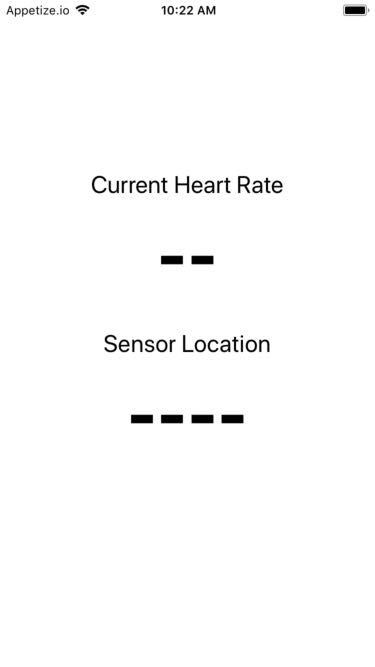

[](https://moveupwards.github.io/Gormsson/)
[](https://developer.apple.com/swift)

[](https://github.com/Carthage/Carthage)
[](http://cocoapods.org/pods/Gormsson)
[](https://www.codacy.com/app/MoveUpwards/Gormsson?utm_source=github.com&amp;utm_medium=referral&amp;utm_content=MoveUpwards/Gormsson&amp;utm_campaign=Badge_Grade)

[](https://github.com/MoveUpwards/Gormsson/blob/master/LICENSE)
[](https://github.com/MoveUpwards/Gormsson/graphs/contributors)
[](https://paypal.me/moveupwards)

# Gormsson

Harald "Bluetooth" Gormsson was a king of Denmark and Norway.

## Requirements

- iOS 9.1+
- Xcode 10.2+

## Installation

### use [CocoaPods](https://cocoapods.org) with Podfile

```swift
pod 'Gormsson'
```

open your favorite terminal, go to your project root path:

```shell
pod install
```

### use [Carthage](https://github.com/Carthage/Carthage) with Cartfile

```shell
github "MoveUpwards/Gormsson"
```

open your favorite terminal, go to your project root path and run:

```shell
carthage update
```

## Usage



### Start the service

Gormsson init method let you define a specific queue to avoid being on `Main thread`. You can also give an optional `Dictionary` for the `CoreBluetooth` manager.

```swift
let manager = Gormsson(queue: DispatchQueue(label: "com.ble.manager", attributes: .concurrent))
```

### Start scan for peripherals

Every peripheral scanned around are return in the `didDiscover` block along with the advertisement data. Check the documentation to see all `GattAdvertisement` properties available.

In the below example, we filter peripheral that provide the `HeartRate` service.

```swift
manager.scan([.heartRate], didDiscover: { [weak self] cbPeripheral, advertisementData in
    print(cbPeripheral)
    print(advertisementData.localName)
    print(advertisementData.txPowerLevel)
    print(advertisementData.isConnectable)
})
```

You can custom's advertisement datas variables. See [Custom advertisement data](https://github.com/MoveUpwards/Gormsson#custom-advertisement-data).

### Connect peripheral

When you connect a peripheral, the library automaticaly stop scan for near peripherals.

```swift
manager.connect(cbPeripheral)
```

### Read characteristic

Let's say you want to read the `Body Sensor Location` provided by your favorite Heart Rate Monitor sensor, you simply ask the manager to read the `.bodySensorLocation` characteristic that will return a value type of `BodySensorLocationEnum`.

```swift
manager.read(.bodySensorLocation, success: { (value: BodySensorLocationEnum?) in
    guard let location = value else { return }

    print("\(location.description)")
}, error: { error in
    print(error ?? "Unknown error")
})
```

### Subscribe characteristic updates

If you want to get the current Heart Rate and have all updated value, you use the `Notify` capability of the characteristic. To achieve this it's as simple as a simply read.

Now any time the value change, the block will be triggered.

```swift
manager.notify(.heartRateMeasurement, success: { (value: HeartRateMeasurementType?) in
    guard let rate = value?.heartRateValue else { return }

    print("\(rate)")
}, error: { error in
    print(error ?? "Unknown error")
})
```

### Write characteristic

If you want to write value to a characteristic, it's pretty straight forward. You provide the characteristic to be used and the given value to write.

```swift
manager.write(.setState, value: UInt8(1), success: {
    print("set state success")
}, error: { error in
    print("set state failure:", error ?? "nil")
})
```

### Custom service

In order to use custom service, you just need to create a custom `GattService`.

```swift
let gpsService = GattService.custom("C94E7734-F70C-4B96-BB48-F1E3CB95F79E")
```

So you can use this custom service to filter the scan peripheral.

```swift
manager.scan([gpsService], didDiscover: { [weak self] peripheral, advertisementData in

})
```

### Custom characteristic

In order to use custom characteristic class that conforms to `CharateristicProtocol`.

```swift
public protocol CharacteristicProtocol {
    var service: GattService { get }
    var uuid: CBUUID { get }
    var format: Any.Type { get }
}
```

Here is an example of a custom characteristc that will provide the number of recorded GPS session.

```swift
public final class GPSSessionCount: CharacteristicProtocol {
    public var uuid: CBUUID {
        return CBUUID(string: "C94E0001-F70C-4B96-BB48-F1E3CB95F79E")
    }

    public var service: GattService {
        return .custom("C94E7734-F70C-4B96-BB48-F1E3CB95F79E")
    }

    public var format: Any.Type {
        return UInt.self
    }
}
```

Then you can use it with read, notify or write BLE command.

```swift
manager.read(GPSSessionCount(), success: { (value: UInt?) in
    print("GPSSessionCount read:", value ?? "nil")
}, error: { error in
    print(error ?? "Unknown error")
})
```

### Custom advertisement data

In case your BLE peripheral has custom manufacturer data, you can add extension to the `GattAdvertisement` class.

Let's say you have the peripheral MAC address provided in the manufacturer data.

```swift
extension GattAdvertisement {
    /// An object containing the manufacturer data of a peripheral.
    open var macAddress: String? {
        let gpsService = GattService.custom("C94E7734-F70C-4B96-BB48-F1E3CB95F79E")
        guard let data = serviceData?[gpsService.uuid] else { return nil }
        return [UInt8](data).map({ String(format: "%02hhx", $0).uppercased() })
            .reversed()
            .joined(separator: ":")
    }
}
```

### Documentation

Have a look at the [Documentation](https://moveupwards.github.io/Gormsson/) to check all the functionnalities `Gormsson` library can provide.

## Contributing

Please read our [Contributing Guide](https://raw.githubusercontent.com/MoveUpwards/Gormsson/master/CONTRIBUTING.md) before submitting a Pull Request to the project.

## Support

For more information on the upcoming version, please take a look to our [ROADMAP](https://github.com/MoveUpwards/Gormsson/projects/).

#### Community support

For general help using Strapi, please refer to [the official Gormsson documentation](https://moveupwards.github.io/Gormsson/). For additional help, you can use one of this channel to ask question:

- [StackOverflow](http://stackoverflow.com/questions/tagged/Gormsson)
- [Slack](http://moveupwards.slack.com) (highly recommended for faster support)
- [GitHub](https://github.com/MoveUpwards/Gormsson).

#### Professional support

We provide a full range of solutions to get better and faster results. We're always looking for the next challenge: consulting, training, develop mobile and web solution, etc.

[Drop us an email](mailto:support@moveupwards.dev) to see how we can help you.

## License

Folding cell is released under the MIT license.
See [LICENSE](https://raw.githubusercontent.com/MoveUpwards/Gormsson/master/LICENSE) for details.

If you use the open-source library in your project, please make sure to credit and backlink to www.moveupwards.dev